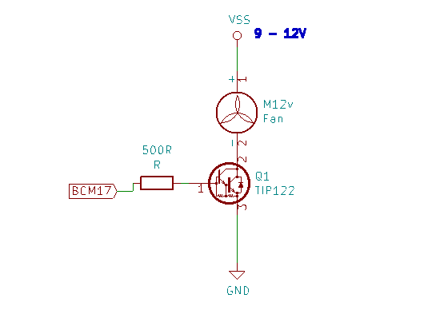
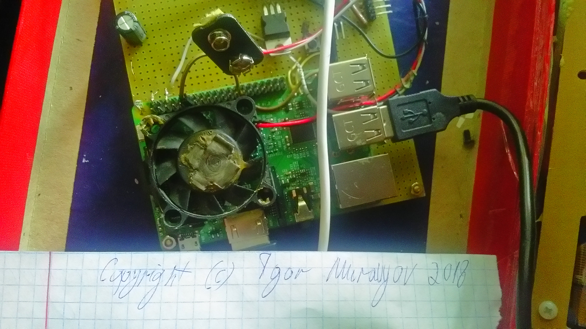

## COOLDOWN usermode driver for popular SBCs
Useful, when you are ~~compiling kernel under it~~ overclocking your device\`s cpu 
or want it to live for a long time.
- It uses custom fan, connected to one of general-purpose pins, 
now it runs under: 
 * RASPBERRY PI 1,2,3 
- with any linux distribution,
can be easily ported to another SOCs, platforms 
(Uses only POSIX and linux sysfs).
- To cool your device down it uses temperature hysteresis 
(for more information please see [config](./config)).
### How to install
- First, you need schematic(ex is for bcm283\*):
 
 * My solution(fan uses 9v battery + 5v SOC power ):
 

- Compiling\Installing
```
make SBC=SBC_NAME
sudo make install
```
Run `make help` to list SBC\_NAME suitable names

- Running:
```
sudo cooldown
```
### See logs
Sometimes it is important to see daemon messanges(our driver implemented as daemon),
driver writes to syslog, there are different ways to see system logs, 
but if your system configuration is based on systemd, run:
```
journalctl -f
```
### Porting guide
TODO 
